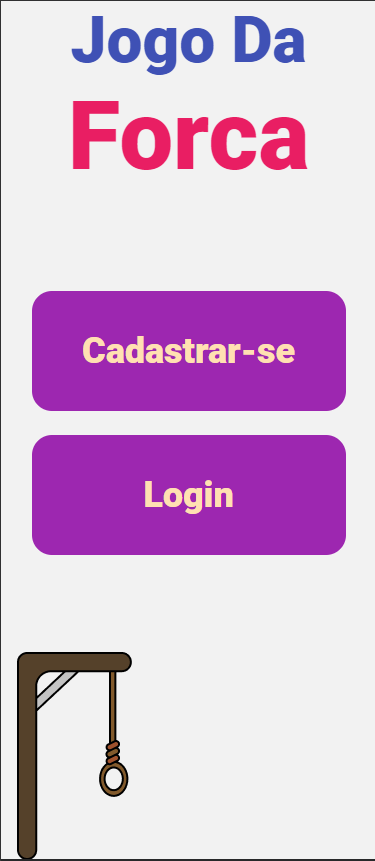
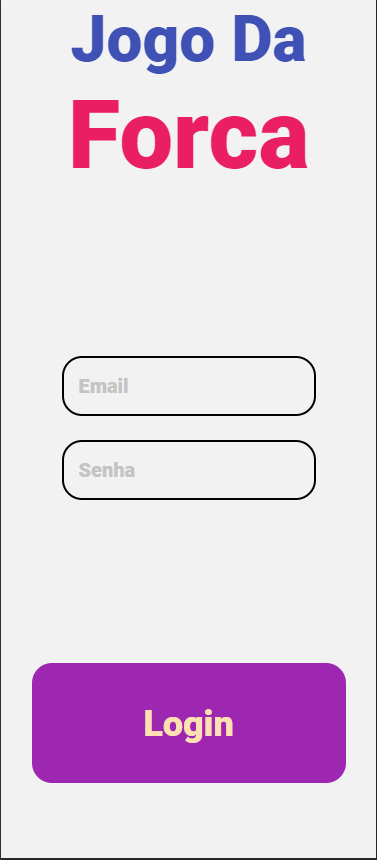
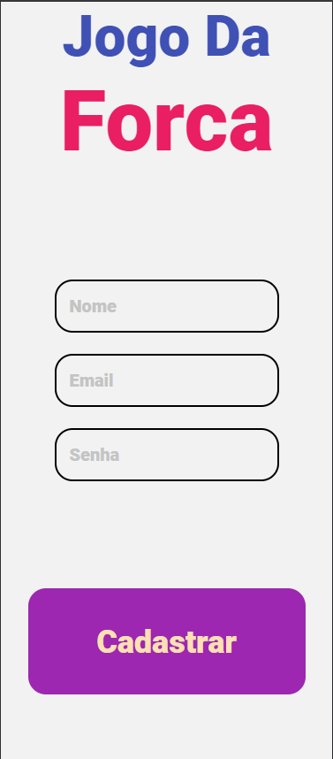
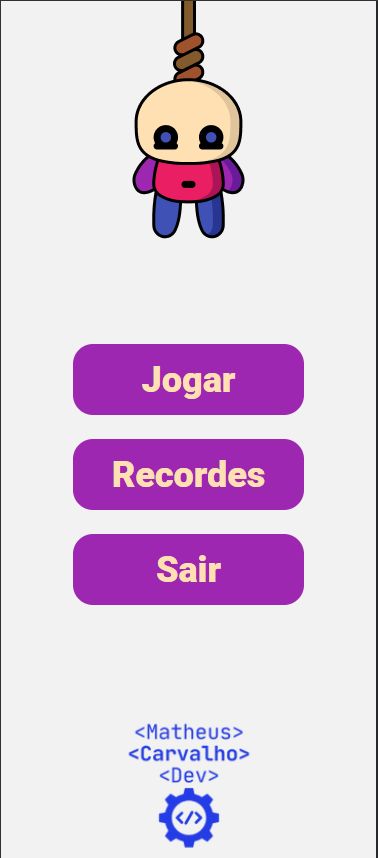
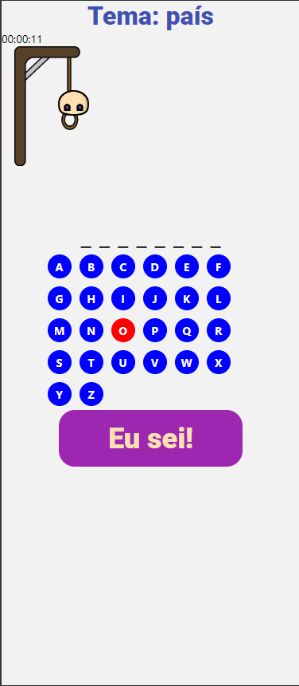
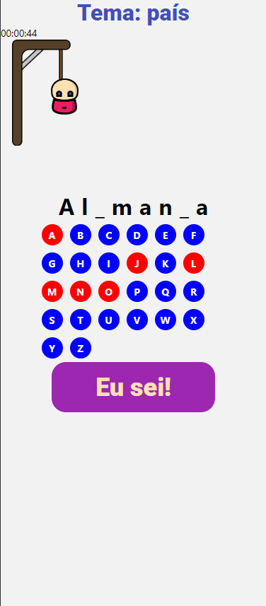
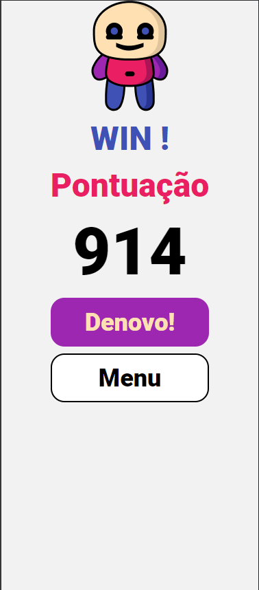
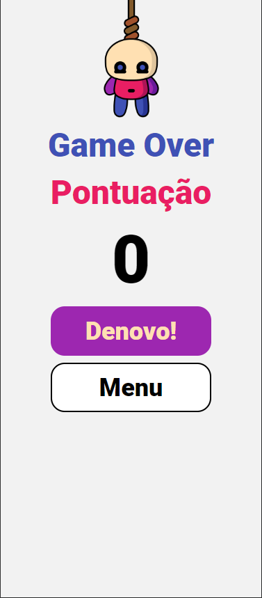

# Jogo da Forca

## Tecnologias Utilizadas

- **React Native**: Framework para desenvolvimento de aplicativos móveis utilizando JavaScript e React.
- **Expo**: Ferramenta para facilitar o desenvolvimento e a construção de aplicativos React Native.
- **expo-google-fonts/roboto**: Para poder utilizar a fonte Roboto
- **Firebase**: Plataforma de desenvolvimento de aplicativos que fornece autenticação, banco de dados em tempo real e armazenamento na nuvem.
- **Moment.js**: Biblioteca para manipulação e formatação de datas.
- **TypeScript**: Superset do JavaScript que adiciona tipagem estática ao código.

## Funcionalidades

- **Tela de Login**: Permite que os usuários façam login utilizando e-mail e senha.
- **Tela de Registro**: Permite que novos usuários se cadastrem no aplicativo.
- **Jogo da Forca**: Os usuários podem jogar o clássico jogo da forca, onde devem adivinhar uma palavra letra por letra. A palavra é sorteada de acordo com um tema, os temas e as palavras para cada tema são predefinidos.
- **Tela de Resultados**: Após o jogo, os usuários são redirecionados para uma tela que mostra se ganharam ou perderam e sua pontuação.
- **Tela de Recordes**: Exibe os melhores resultados dos jogadores (implementação futura).

## Arquitetura do Projeto

O projeto foi organizado em uma estrutura de pastas que facilita a manutenção e a escalabilidade. Abaixo está uma breve descrição da estrutura:

- **src/**: Contém todo o código-fonte do aplicativo.
  - **app/**: Contém os componentes principais do aplicativo, como telas e lógica de navegação.
    - **Login.tsx**: Componente responsável pela tela de login.
    - **Register.tsx**: Componente responsável pela tela de registro.
    - **Menu.tsx**: Componente que serve como menu principal do jogo.
    - **Game.tsx**: Componente que contém a lógica do jogo da forca.
    - **WinScreen.tsx**: Tela exibida quando o jogador ganha.
    - **LoseScreen.tsx**: Tela exibida quando o jogador perde.
    - **ScoreBoard.tsx**: Tela para exibir os recordes (implementação futura).
  - **context/**: Contém o contexto de autenticação, que gerencia o estado do usuário.
  - **components/**: Contém componentes reutilizáveis, como botões e modais.
  - **assets/**: Contém os arquivos de estilo e imagens utilizadas no aplicativo.

## Imagens

Aqui estão algumas imagens do aplicativo:

### Tela Inicial


### Tela de Login


### Tela de Registro


### Menu do Jogo


### Jogo - Etapa 1


### Jogo - Etapa 2


### Tela de Vitória


### Tela de Derrota


## Como Rodar o Projeto Localmente

Para rodar o projeto localmente, siga os passos abaixo:

1. **Clone o repositório**:
   ```bash
   git clone https://github.com/MatheusRicardoCarvalho/forca.git
   cd forca
   ```

2. **Instale as dependências**:
   ```bash
   npm install
   ```

3. **Configure o Firebase**:
   - Crie um projeto no [Firebase Console](https://console.firebase.google.com/).
   - Adicione um aplicativo e copie as credenciais de configuração do Firebase.
   - Atualize as credenciais no arquivo `src/services/firebase.js`.

4. **Inicie o servidor de desenvolvimento**:
   ```bash
   npx expo start
   ```

5. **Abra o aplicativo**:
   - Use um emulador Android/iOS ou escaneie o QR code com o aplicativo Expo Go no seu dispositivo móvel.

